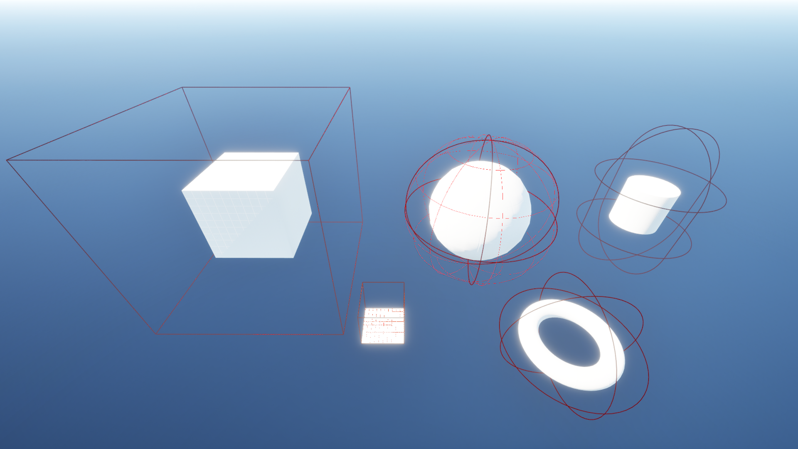
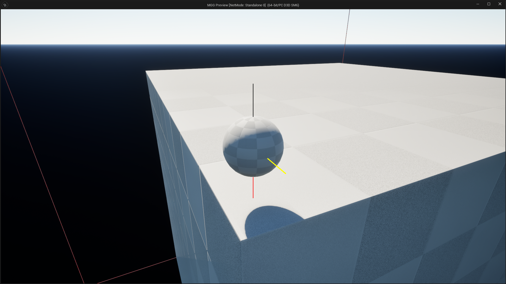
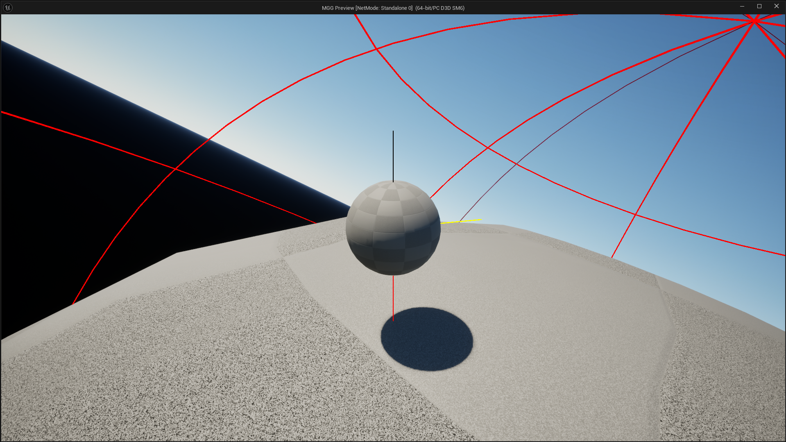
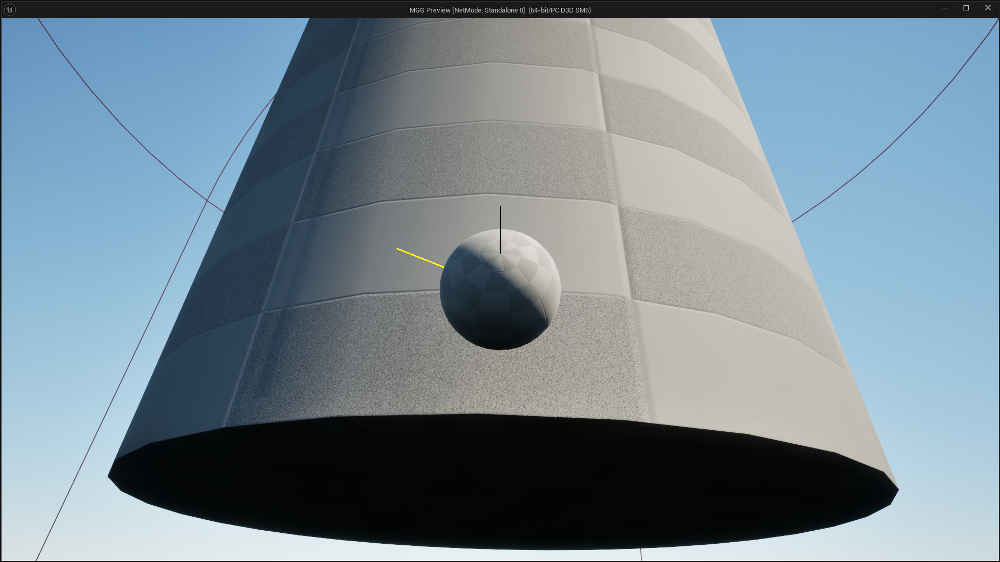
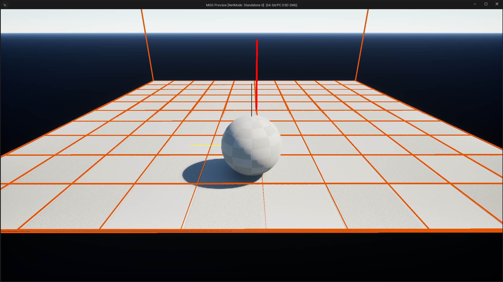
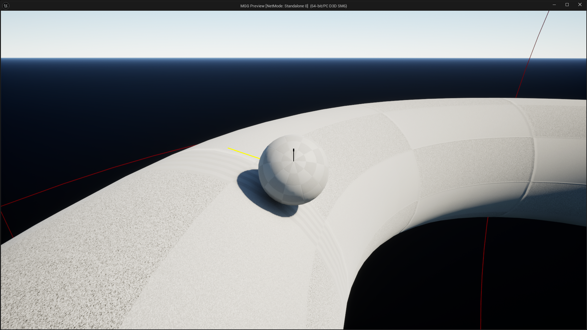

# Mario Galaxy Gravity - Unreal Engine 5

This project is an implementation of the gravity system from Super Mario Galaxy, created in C++ with Unreal Engine 5. It reproduces the specific gravity mechanism for each planet, allowing the player to walk on surfaces of different geometric shapes, with gravity always oriented perpendicular to the surface.


## Summary

- [Project pitch](#project-pitch)
- [Controls](#controls)
- [Project pictures](#project-pictures)
- [Technical Section](#technical-section)
- [How to use the project](#how-to-use-the-project)
- [Creating a new planet](#creating-a-new-planet)
- [Possible improvements](#possible-improvements)

## Project pitch

This project implements the unique gravity system from Super Mario Galaxy, where gravity is not a uniform downward force, but rather a force that attracts the player toward the center or surface of different planets. Depending on the shape of the planet (sphere, cube, cylinder, torus, etc.), the gravity calculation differs to create a coherent gameplay experience.

Main features:
- Different types of planets with their own gravity fields
- Priority system to handle areas where multiple gravity fields overlap
- Automatic character rotation based on local gravity
- Procedural generation of certain planet shapes (torus)
- Visualization of gravity fields for debugging

> **Note:** The movement system is experimental and not the main focus of this project. The primary goal was to implement the gravity calculation system.

**Development team:**
- [@LeoSery](https://github.com/LeoSery)
- [@PepsiThib](https://github.com/pepsithib)

## Controls

- **Movement**: Z (forward), Q (left), S (backward), D (right)
- **Camera rotation**: Mouse

## Project pictures








## Technical Section

### Gravity Fields

The gravity system is based on a modular component architecture. Each type of gravity field inherits from a base class `UBaseGravityFieldComponent` which defines the common interface and shared functionality.

```cpp
class MGG_API UBaseGravityFieldComponent : public USceneComponent
{
public:
    virtual FVector CalculateGravityVector(const FVector& TargetLocation) const;
    virtual void UpdateGravityVolume();
    
    // Priority system to handle overlapping fields
    FORCEINLINE int32 GetGravityFieldPriority() const { return GravityFieldPriority; }
};
```

Each type of planet has its own gravity field component that implements specific logic to calculate the gravity vector. For example, for a spherical planet:

```cpp
FVector USphereGravityFieldComponent::CalculateGravityVector(const FVector& TargetLocation) const
{
    FVector DirectionToCenter = GetComponentLocation() - TargetLocation;
    return DirectionToCenter.GetSafeNormal() * GravityStrength;
}
```

For more complex shapes like the cube, the implementation is more elaborate:

```cpp
FVector UCubeGravityFieldComponent::CalculateGravityVector(const FVector& TargetLocation) const
{
    // Determines on which face, edge or corner the player is located
    FCubePositionFlags Flags = CalculatePositionFlags(RelativePosition, Extent);
    
    // Calculates the gravity vector based on position
    FVector GravityVector = ConstructGravityComponentVector(Flags);
    
    return GravityVector.GetSafeNormal() * GravityStrength;
}
```

### Interface and Priority System for Gravity Fields

To enable different objects to interact with gravity fields, the project uses the `IGravityAffected` interface. This interface also handles situations where multiple fields overlap through a priority system.

```cpp
class MGG_API IGravityAffected
{
public:
    // List of gravity fields affecting the object
    TArray<UBaseGravityFieldComponent*> GravityFields;
    
    // Determines the priority gravity field
    UBaseGravityFieldComponent* GetActiveGravityField()
    {
        // If multiple fields affect the object, we select the one
        // with the highest priority
        if (GravityFields.Num() > 0)
        {
            UBaseGravityFieldComponent* ActiveField = GravityFields[0];
            int32 HighestPriority = ActiveField->GetGravityFieldPriority();
            
            for (auto* Field : GravityFields)
            {
                if (Field->GetGravityFieldPriority() > HighestPriority)
                {
                    ActiveField = Field;
                    HighestPriority = Field->GetGravityFieldPriority();
                }
            }
            return ActiveField;
        }
        return nullptr;
    }
};
```

This system allows for proper transitions between gravity fields and ensures that the object is always influenced by the most relevant field based on its position and configured priorities.

### Planets

Each planet is a class derived from `ABasePlanet`, which automatically configures the appropriate mesh and corresponding gravity field component.

```cpp
class MGG_API ABasePlanet : public AActor
{
protected:
    UPROPERTY(VisibleAnywhere, Category = "Components")
    UStaticMeshComponent* PlanetMesh;
    
    // Parameters configurable in the editor
    UPROPERTY(EditAnywhere, Category = "Planet Settings")
    float PlanetRadius;
    
    UPROPERTY(EditAnywhere, Category = "Planet Settings|Gravity")
    float GravityStrength;
    
    UPROPERTY(EditAnywhere, Category = "Planet Settings|Gravity")
    int32 GravityFieldPriority;
};
```

This architecture makes it easy to add new types of planets by deriving from the base class and implementing the necessary specifics.

### Procedural Meshes

For shapes like the torus, which are not available in Unreal's standard primitives, we use a procedural mesh generation system.

```cpp
void UTorusMeshComponent::GenerateTorusMesh()
{
    // Vertex generation
    for (int32 i = 0; i < TorusSegments; i++)
    {
        float Angle1 = (2.0f * PI * i) / TorusSegments;
        // Calculate position of secondary circle center
        FVector CircleCenter(
            TorusRadius * FMath::Cos(Angle1),
            TorusRadius * FMath::Sin(Angle1),
            0
        );
        
        // Generate points on the torus tube
        for (int32 j = 0; j < TubeSegments; j++)
        {
            // [Vertex generation code]
        }
    }
    
    // Triangle generation
    for (int32 i = 0; i < TorusSegments; i++)
    {
        // [Triangulation code]
    }
}
```

### Movement

The character implements the `IGravityAffected` interface which allows it to interact with gravity fields. When it enters a field, the field modifies the gravity applied to the character. Movement is relative to local gravity, allowing for natural walking on all surfaces.

> **Note:** The movement system is experimental and primarily serves as a demonstration of the gravity system. It was not the main focus of development.

```cpp
void AMGG_Mario::PhysicProcess(float DeltaTime)
{
    // Update active gravity field
    UpdateCurrentGravityField();
    
    // Calculate movement relative to gravity
    FVector Up = -GravityVector.GetSafeNormal();
    Forward = FVector::VectorPlaneProject(Forward, Up).GetSafeNormal();
    Right = FVector::VectorPlaneProject(Right, Up).GetSafeNormal();
    
    // Apply movement
    FVector NewLocation = GetActorLocation() + (Velocity * DeltaTime * Speed) + (GravityVector * DeltaTime);
    SetActorLocation(NewLocation, true);
    
    // Rotate character to align with surface
    RotatingMario();
}
```

## How to use the project

### Installation

1. Clone the Git repository or download the source files
2. Open the project in Unreal Engine 5 (version 5.4 or higher recommended)
3. Open the "Main" map in the "Maps" folder

### Configuring Planet parameters

Each planet has several adjustable parameters:

- **Planet Radius**: Size of the planet
- **Gravity Strength**: Force of gravity
- **Field Priority**: Priority of the field (useful when multiple fields overlap)
- **Gravity Influence Range**: Range of the gravity field beyond the surface

Some planets that have custom shapes, such as the procedurally generated 'Torus' planet, have specific additional parameters that are linked to their mesh:

- **Torus Radius** : Distance from the center of the torus to the center of the tube (main radius)
- **Tube Radius** : Thickness/radius of the tube that forms the ring
- **Torus segments** : Number of segments around the main circle (higher values create a smoother circle)
- **Tube segments** : Number of segments around the tube's circumference (higher values create a smoother tube surface)


## Creating a new planet

To create a new type of planet with its own gravity field:

1. **Create a gravity field component**

```cpp
// NewGravityFieldComponent.h
#pragma once

#include "CoreMinimal.h"
#include "BaseGravityFieldComponent.h"
#include "NewGravityFieldComponent.generated.h"

UCLASS()
class MGG_API UNewGravityFieldComponent : public UBaseGravityFieldComponent
{
    GENERATED_BODY()

public:
    UNewGravityFieldComponent();
    
    virtual void UpdateGravityVolume() override;
    
protected:
    virtual FVector CalculateGravityVector(const FVector& TargetLocation) const override;
    virtual FGravityFieldDimensions CalculateFieldDimensions() const override;
};
```

2. **Implement specific gravity calculation**

```cpp
// NewGravityFieldComponent.cpp
FVector UNewGravityFieldComponent::CalculateGravityVector(const FVector& TargetLocation) const
{
    // Implement your gravity calculation logic here
}
```

3. **Create the planet class**

```cpp
// NewPlanet.h
#pragma once

#include "CoreMinimal.h"
#include "BasePlanet.h"
#include "NewGravityFieldComponent.h"
#include "NewPlanet.generated.h"

UCLASS()
class MGG_API ANewPlanet : public ABasePlanet
{
    GENERATED_BODY()

public:
    ANewPlanet();
    
protected:
    UPROPERTY(VisibleAnywhere, Category = "Components")
    UNewGravityFieldComponent* NewGravityField;
};
```

4. **Initialize the planet with the appropriate mesh and gravity field**

```cpp
// NewPlanet.cpp
ANewPlanet::ANewPlanet()
{
    PrimaryActorTick.bCanEverTick = true;

    // Set the appropriate mesh
    static ConstructorHelpers::FObjectFinder<UStaticMesh> MeshAsset(TEXT("/Engine/BasicShapes/YourShape"));
    if (MeshAsset.Succeeded() && PlanetMesh)
    {
        PlanetMesh->SetStaticMesh(MeshAsset.Object);
        DefaultMesh = MeshAsset.Object;
    }

    // Create and configure the gravity field
    NewGravityField = CreateDefaultSubobject<UNewGravityFieldComponent>(TEXT("NewGravityField"));
    NewGravityField->SetupAttachment(RootComponent);
}
```

## Possible improvements

1. **Movement system**
   - Complete redesign of the movement system for better fluidity
   - Addition of special movements (jump, wall-jump, etc.)
   - This would be the top priority for improving the project, as the current implementation is experimental

2. **Graphical optimizations**
   - Improvement of planet materials
   - Visual effects for transitions between gravity fields

3. **Planet transition system**
   - Fluid animations for transitions between gravity fields